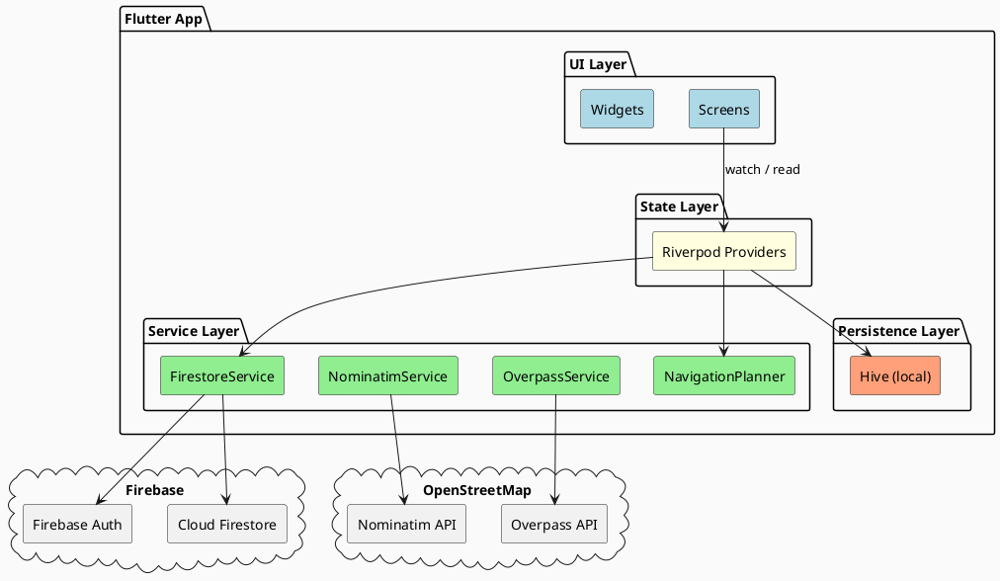

# Fairelescourses — Architecture Overview

Fairelescourses is a Flutter (Android-first) supermarket navigation app. Users map their local shops as a grid, build shopping lists, and the app plans an optimised walking route through the store. Households can share lists and navigate collaboratively in real time via Firebase.

## Document Index

| Document | Contents |
|---|---|
| [data-models.md](data-models.md) | Core data classes, Hive persistence, relationships |
| [state-management.md](state-management.md) | Riverpod provider graph, state lifecycle |
| [screens-navigation.md](screens-navigation.md) | Screen hierarchy and user flows |
| [services.md](services.md) | External service integrations (Firestore, OSM, navigation planner) |
| [persistence.md](persistence.md) | Local (Hive) and remote (Firestore) storage schemas |
| [key-flows.md](key-flows.md) | Sequence diagrams for the most important user journeys |

## High-Level Architecture



## Technology Stack

| Concern | Library / Version |
|---|---|
| UI framework | Flutter 3.x, Material Design 3 |
| State management | flutter_riverpod ^3.0.0 |
| Local persistence | hive_ce ^2.9.0 |
| Remote sync | cloud_firestore ^6.1.3 + firebase_auth ^6.2.0 |
| Geocoding | Nominatim (HTTP, nominatim_service.dart) |
| Nearby shop search | Overpass API (HTTP, overpass_service.dart) |
| Maps | flutter_map ^8.0.0 + latlong2 |
| Localisation | Flutter intl, ARB files (EN + DE) |
| Encryption | encrypt ^5.0.3 (AES-256-CBC) |

## Directory Layout

```
lib/
├── main.dart                # App entry point, Hive init, ProviderScope
├── firebase_options.dart    # Default Firebase config
├── hive_registrar.g.dart    # Generated Hive adapter registration
├── models/                  # Data classes + Hive adapters
├── providers/               # Riverpod providers & notifiers
├── services/                # External API clients
├── screens/                 # Full-page UI
├── widgets/                 # Reusable UI components
└── l10n/                    # ARB files + generated AppLocalizations
```
