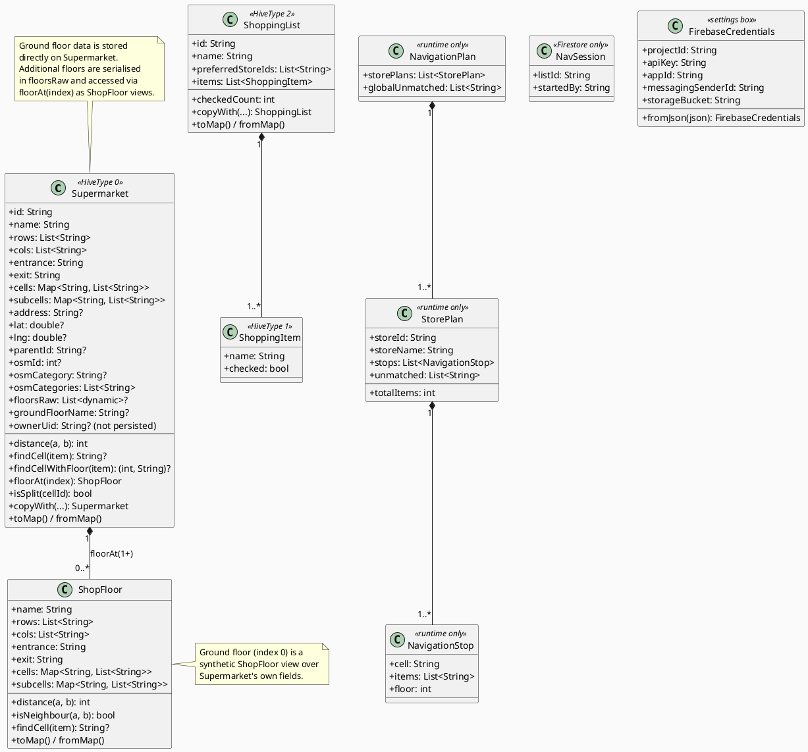

# Data Models

All persistent models live in `lib/models/`. Runtime-only models are also kept there for co-location.

## Class Diagram

## Model Details

### Supermarket

The central domain object. Represents a physical shop as a named 2D grid.

- **Grid cells** are identified by `"<row><col>"` strings, e.g. `"A1"`, `"C3"`.
- **`cells`** maps each cell ID to a list of product tags (goods). Tags are matched against shopping list items.
- **`subcells`** holds draft cell-split data (`"A1:h:0"` / `"A1:h:1"` etc.). A split can be promoted to a real row/column division.
- **`floorsRaw`** stores additional floors as serialised `Map<String, dynamic>` (ShopFloor toMap). Ground floor fields live directly on Supermarket.
- **Item matching** is a three-pass search:
  1. Exact match of any tag against the item name.
  2. All words in the item name appear in a tag.
  3. Any word in the item name is a substring of a tag.

### ShoppingList / ShoppingItem

A named list of grocery items with a `checked` flag per item. `preferredStoreIds` drives which shops the planner tries first.

### NavigationPlan (runtime)

Produced by `NavigationPlanner.plan()`. Never stored on disk. Contains one `StorePlan` per shop that covers at least one item, plus a `globalUnmatched` list of items found in no shop.

### NavSession (Firestore only)

Minimal document stored in Firestore to signal an active collaborative navigation session. All participants watch the same Firestore path; item check-offs are persisted on the shopping list itself.

### FirebaseCredentials (settings box)

Persisted as JSON in the Hive `settings` box under the key `firebase_custom_credentials`. Allows users to point the app at their own Firebase project.
