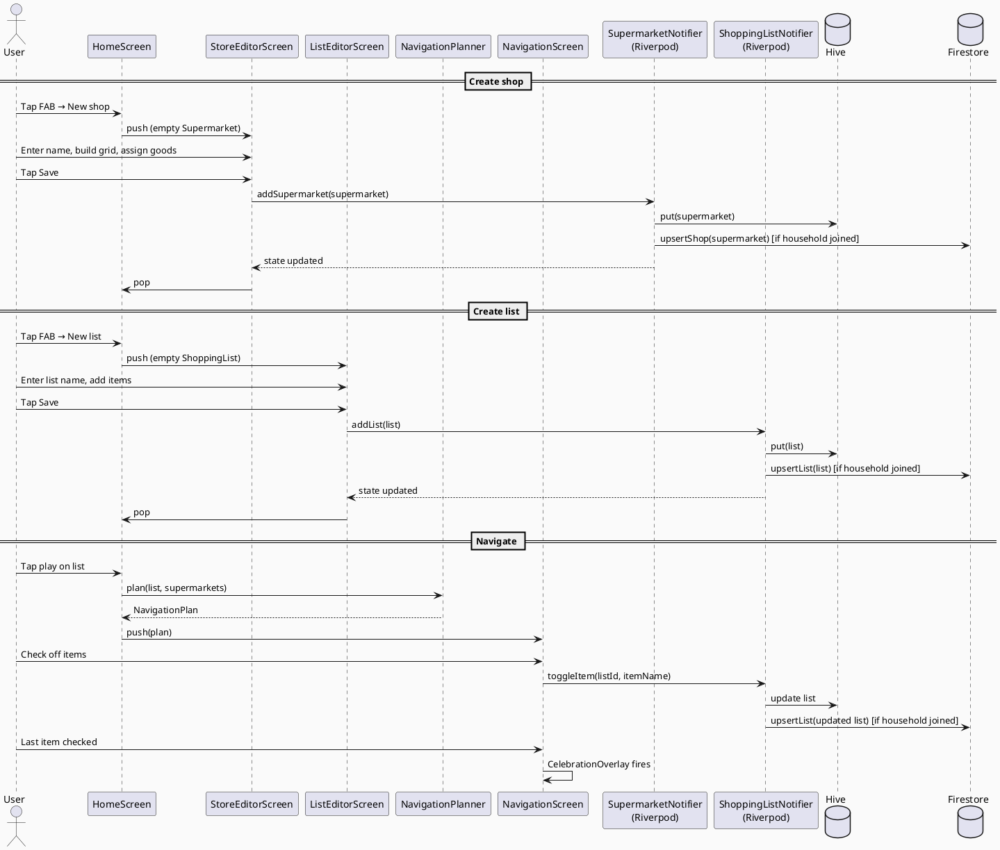
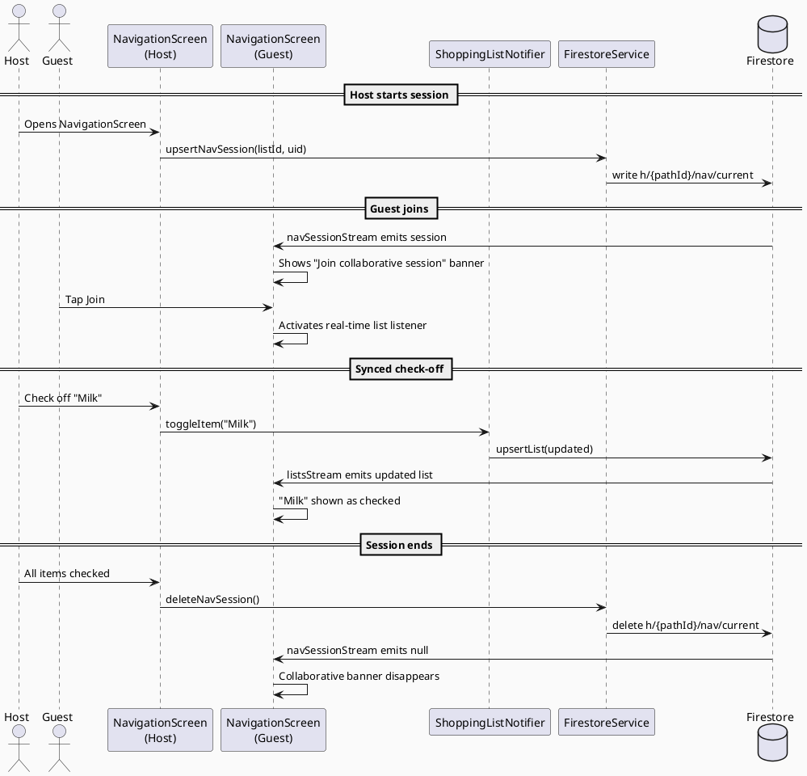
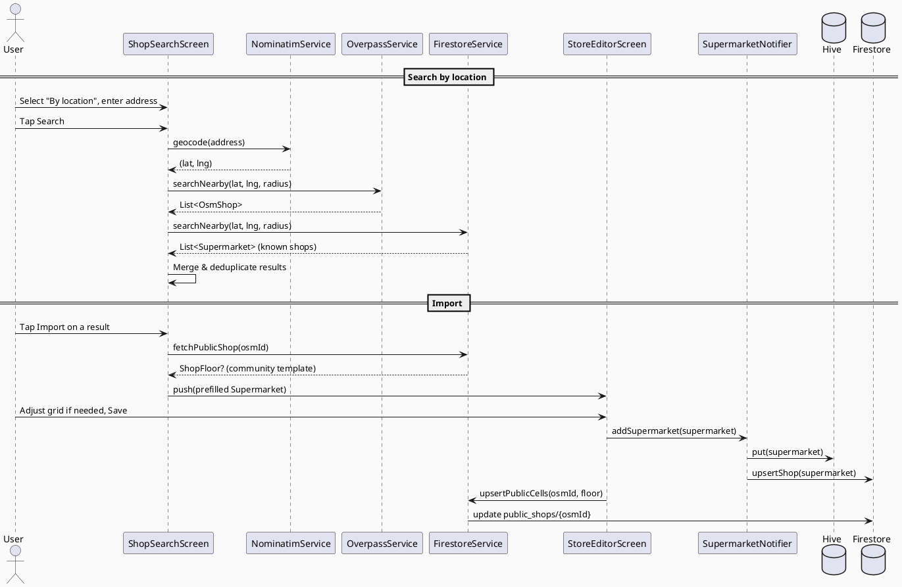
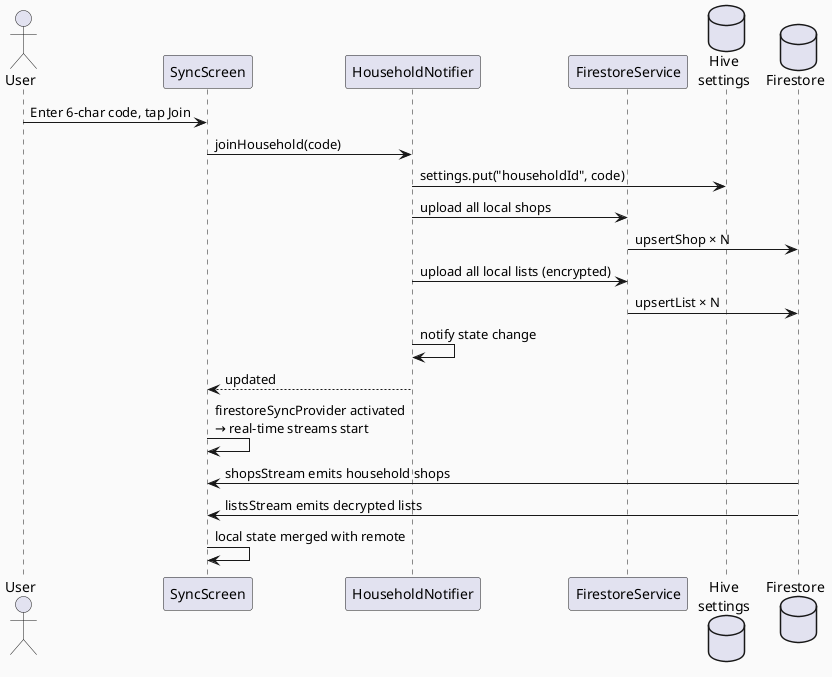
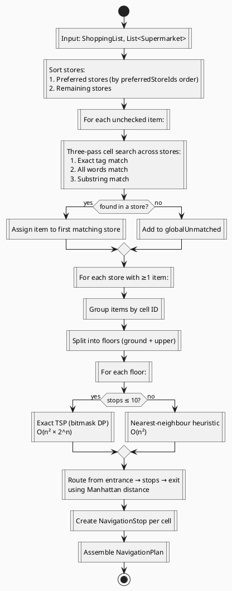

# Key User Flows

Sequence diagrams for the most important journeys through the app.

---

## 1. Create a Shop and Navigate a List

---

## 2. Collaborative Navigation

---

## 3. Search and Import a Shop

---

## 4. Join a Household

---

## 5. Navigation Planning Algorithm

