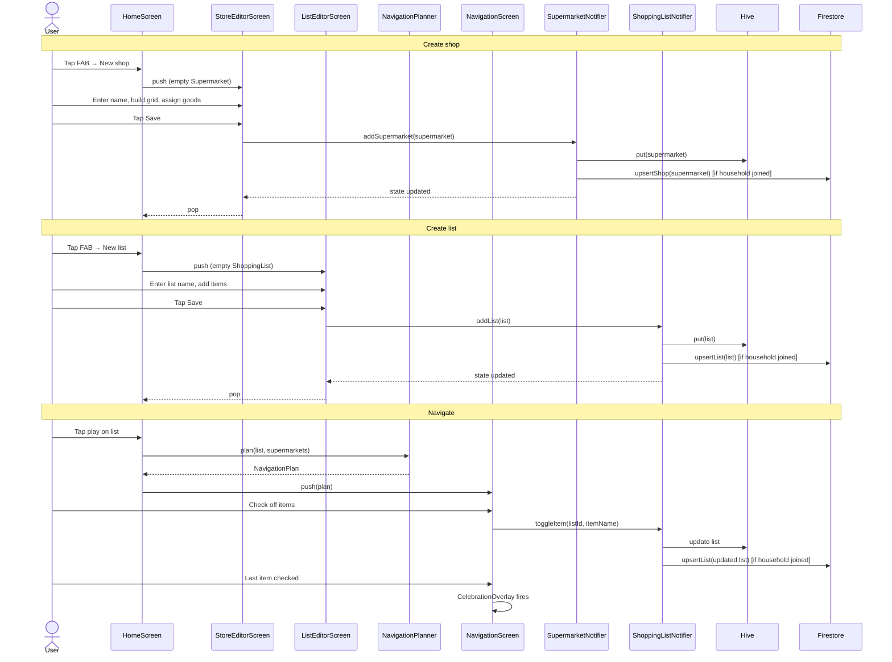
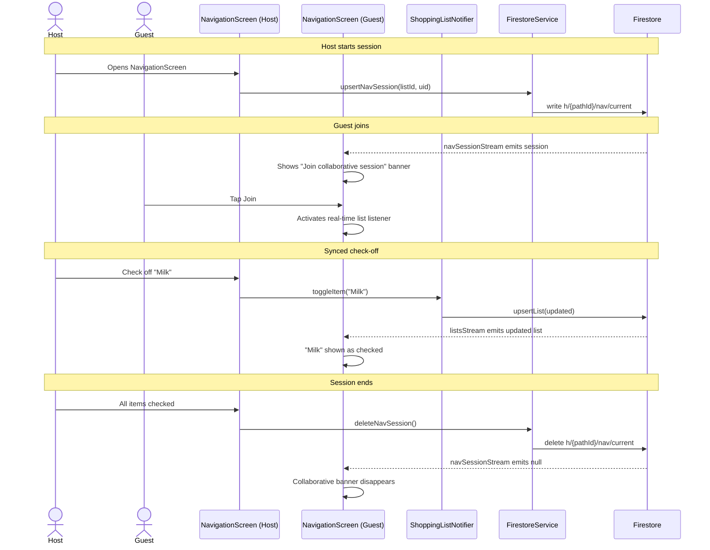
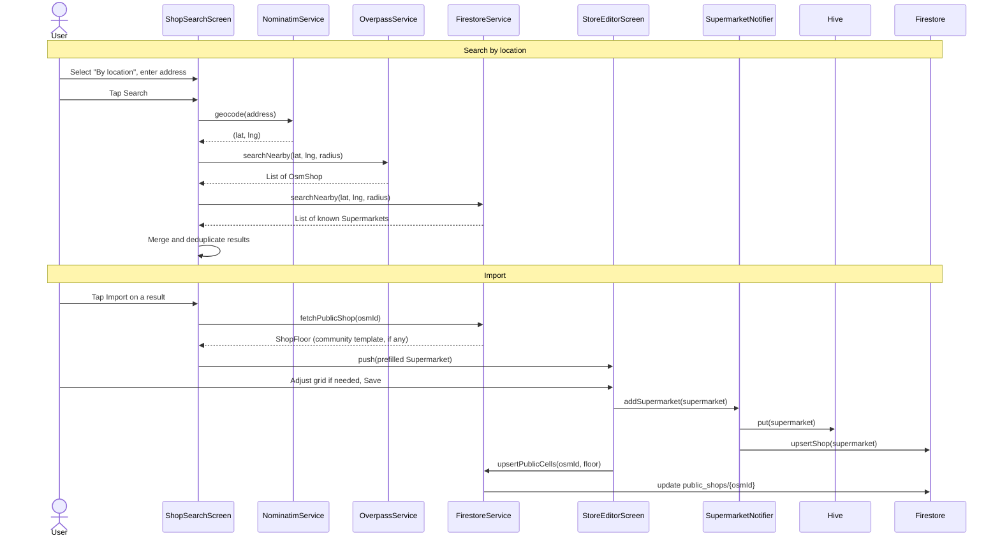
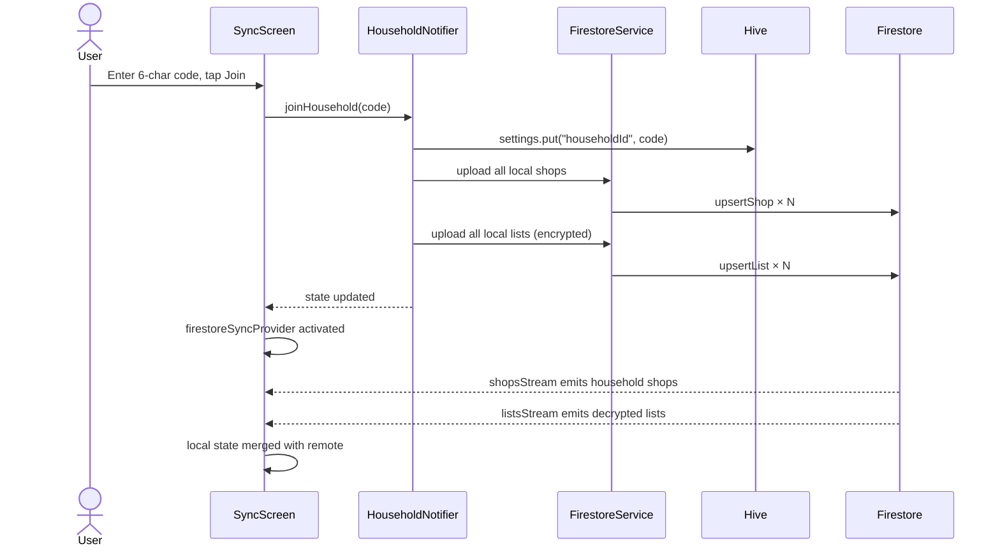
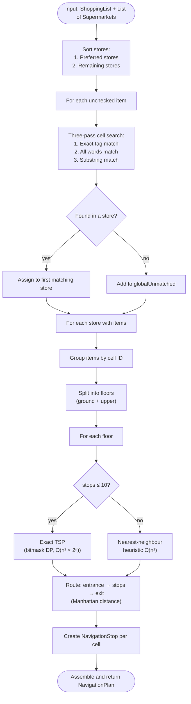

# Key user flows

Sequence diagrams for the most important journeys through the app.

---

## 1. Create a shop and navigate a list

---

## 2. Collaborative navigation

---

## 3. Search and import a shop

---

## 4. Join a household

---

## 5. Navigation planning algorithm

