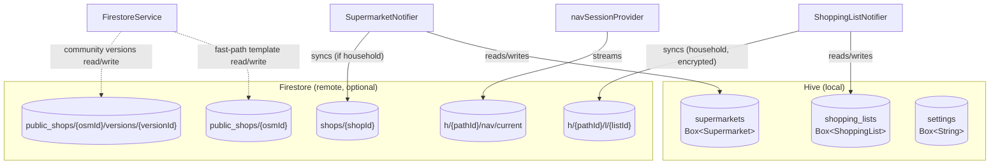

# Persistence

The app is **offline-first**. All user data is stored locally in Hive. Firestore is an optional sync layer that activates only when the user joins a household.

## Storage architecture



---

## Hive local storage

Hive is initialised in `main()` before the app starts. Adapters are registered via the generated `hive_registrar.g.dart`.

### Boxes

| Box name | Type | HiveType IDs | Contents |
|---|---|---|---|
| `supermarkets` | `Box<Supermarket>` | 0 | All saved shop grids |
| `shopping_lists` | `Box<ShoppingList>` | 2 (list), 1 (item) | All shopping lists |
| `settings` | `Box<String>` | — (String primitives) | Key-value app settings |
| `item_categories` | `Box<String>` | — (String primitives) | Item name → category mapping (key: lowercased item name) |

### Settings keys

| Key | Type | Default | Description |
|---|---|---|---|
| `localOnly` | `"true"` / `"false"` | `"false"` | Disable all Firebase/Firestore |
| `householdId` | 6-char string | `null` | Current household code |
| `seedColor` | hex `"#RRGGBB"` | app default | Theme seed colour |
| `navViewMode` | `"list"` / `"grid"` | `"grid"` | Default navigation view |
| `introSeen` | `"true"` / `"false"` | `"false"` | Tour completion flag |
| `homeAddress` | string | `null` | Human-readable home address |
| `homeLat` | string (double) | `null` | Home latitude |
| `homeLng` | string (double) | `null` | Home longitude |
| `firebase_custom_credentials` | JSON string | `null` | Custom Firebase project config |

### Code generation

Hive type adapters are generated by `hive_ce_generator`. Run after changing model classes:

```bash
dart run build_runner build --delete-conflicting-outputs
```

Generated files: `supermarket.g.dart`, `shopping_list.g.dart`, `hive_registrar.g.dart`.

---

## Firestore schema

Firestore is only used when `localOnly == false` and the user has joined a household.

### `shops/{shopId}` — Shop layouts

Unencrypted. Shared within a household.

```
{
  id: String,
  name: String,
  nameLower: String,          // lowercase copy for Firestore prefix queries
  rows: [String],
  cols: [String],
  entrance: String,
  exit: String,
  cells: Map<String, [String]>,
  subcells: Map<String, [String]>,
  address: String?,
  lat: double?,
  lng: double?,
  parentId: String?,          // osmId-derived, if imported from public_shops
  osmId: int?,
  osmCategory: String?,
  osmCategories: [String],
  floorsRaw: [Map],           // serialised additional ShopFloor objects
  groundFloorName: String?,
  ownerUid: String,
  householdHash: String       // SHA-256(householdId), used for queries
  goodsList: [String]         // flat list of all goods tags (for item search)
}
```

Indexes used:
- `householdHash` (equality) — fetch all shops for a household
- `nameLower` (range) — prefix search by shop name
- `goodsList` (array-contains) — search by item name

### `public_shops/{osmId}` — Fast-path OSM template

Unencrypted. Written (overwritten) automatically every time any user saves an OSM-linked shop (`SupermarketNotifier` calls `upsertPublicCells` on both `add` and `update`). Also overwritten when a layout version is explicitly published. Read by `fetchPublicShop` to auto-populate the editor when a different user imports the same OSM shop, without querying the versions subcollection.

```
{
  osmId: int,
  rows: [String],
  cols: [String],
  entrance: String,
  exit: String,
  cells: Map<String, [String]>,
  updatedAt: Timestamp
}
```

### `public_shops/{osmId}/versions/{versionId}` — Community layout versions

Unencrypted. One document per published layout. Documents are never overwritten — only appended. Any authenticated user may read or write.

```
{
  osmId: int,
  publishedBy: String,          // Firebase UID
  publishedAt: Timestamp,
  importCount: int,             // incremented atomically on each import
  shopName: String,
  address: String?,
  rows: [String],
  cols: [String],
  entrance: String,
  exit: String,
  cells: Map<String, [String]>,
  subcells: Map<String, [String]>?,   // omitted if empty
  floors: [Map]?                      // omitted if single-floor
}
```

Queried as: `orderBy('importCount', descending: true).limit(20)`.

### `h/{pathId}/l/{listId}` — Encrypted shopping lists

`pathId` = hex(SHA-256(householdId)). Contents are opaque to Firestore.

```
{
  d: String    // base64(IV + AES-256-CBC(JSON(ShoppingList), key=SHA-256(householdId)))
}
```

The plaintext `JSON(ShoppingList)` matches the `ShoppingList.toMap()` format.

### `h/{pathId}/nav/current` — Collaborative navigation session

```
{
  listId: String,
  startedBy: String,    // Firebase UID
  startedAt: Timestamp
}
```

Only one session document exists per household at a time. Deleting it ends the session for all participants.

---

## Data consistency

- **Optimistic writes**: UI updates immediately; Hive write follows; Firestore write is best-effort.
- **Conflict resolution**: Firestore is the source of truth for shared data. `mergeFromRemote` in each notifier replaces local records that differ from the server version.
- **Offline behaviour**: Firestore SDK caches the last known state. Writes are queued and flushed when connectivity resumes.
- **Household leave**: On leave, the local copies are kept; the household reference is cleared and Firestore listeners are torn down.
