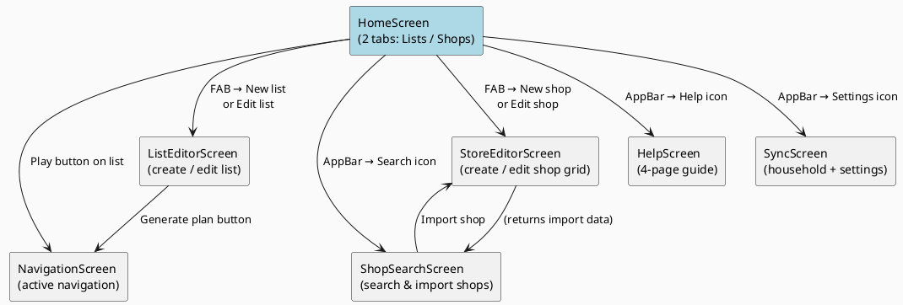
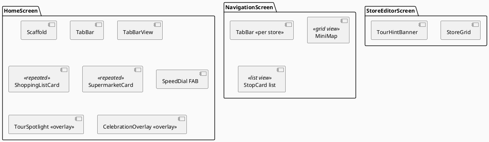

# Screens & Navigation

The app uses Flutter's standard `Navigator` (push/pop) — there is no named-route or go_router setup. All routes are pushed imperatively from within screen callbacks.

## Screen Hierarchy

## Screen Descriptions

### HomeScreen (`lib/screens/home_screen.dart`)

The app's root screen with a `TabController` for two tabs:

- **Lists tab** — scrollable list of `ShoppingList` cards. Each card has: play (navigate), edit, and delete actions.
- **Shops tab** — scrollable list of `Supermarket` cards. Each card has: edit and delete actions.

**AppBar actions:** Help (pushes HelpScreen), Search shops (pushes ShopSearchScreen), Settings (pushes SyncScreen).

**FAB** expands into three mini-buttons: New shop, New list, Import (alias for ShopSearchScreen). The tour spotlight highlights the FAB and its children.

`HomeScreen` watches `firestoreSyncProvider` (a side-effect provider) to activate Firestore listeners as soon as the home screen is visible.

---

### ListEditorScreen (`lib/screens/list_editor_screen.dart`)

Create or edit a shopping list.

Key interactions:
- Add items via a `TextField` + add button (or keyboard submit).
- Remove items with a trailing delete icon.
- Multi-select preferred stores via a chip list (drives planner store ordering).
- **Generate plan** builds a `NavigationPlan` synchronously via `NavigationPlanner` and pushes `NavigationScreen`.
- Unsaved changes trigger a confirmation dialog on back-press.

A `TourHintBanner` is shown at the bottom during tour step 1.

---

### StoreEditorScreen (`lib/screens/store_editor_screen.dart`)

Create or edit a supermarket grid.

Key interactions:
- Set name, address (auto-geocoded via Nominatim on save), entrance, and exit cells.
- Adjust grid dimensions with add/remove row and column buttons.
- Tap a cell to edit its goods (comma-separated tags).
- Long-press a cell to set it as entrance or exit.
- Double-tap a cell to enter split-cell mode (divides the cell into sub-cells).
- Multi-floor: add/remove floors, rename floor labels.
- Pre-fill from a public OSM template when importing.

A `TourHintBanner` is shown at the bottom during tour step 0.

---

### NavigationScreen (`lib/screens/navigation_screen.dart`)

Active in-store navigation. Accepts a `NavigationPlan` from the constructor.

Key features:
- Tab bar per store (if the plan covers multiple shops).
- **Grid view** (default): `MiniMap` widget showing the shop grid with highlighted cells.
- **List view**: Ordered stop cards, each expandable to show the items at that stop.
- Tap an item to check it off (updates `ShoppingList` via provider + Firestore if collaborative).
- Adjacent cell highlighting — once an item is checked, the adjacent cells to the last visited cell are highlighted on the map.
- **Deferral actions** per item: collect later (keep in current store plan), try at next shop, add to a new list.
- Progress indicator: `X/Y items` in the AppBar.
- **Collaborative mode**: if `navSessionProvider` returns an active session for this list, all check-offs sync via Firestore in real time.
- `CelebrationOverlay` fires when the last item is checked.

---

### ShopSearchScreen (`lib/screens/shop_search_screen.dart`)

Discover and import supermarkets.

Three search modes (segmented button):
1. **By name** — queries Firestore `shops` collection on `nameLower`.
2. **By item** — queries Firestore `shops` collection on `goodsList` array field.
3. **By location** — geocodes the query via Nominatim, then queries Overpass API for nearby shops, then cross-references Firestore for known layouts.

Results are shown as a list of cards (or on a `flutter_map` map). Proximity distance from the user's home location is shown when available.

Import action: opens `StoreEditorScreen` pre-filled with the result's data. Duplicate detection prevents importing a shop already within 0.2 km of an existing one.

---

### HelpScreen (`lib/screens/help_screen.dart`)

A 4-page `PageView` explaining: Shops, Lists, Navigation, and Sync. Slide indicators and Next/Done buttons.

---

### SyncScreen (`lib/screens/sync_screen.dart`)

Household management and app settings:

- **Household**: join (enter code), create (generate), share (clipboard), leave.
- **Home location**: address field + Nominatim geocode.
- **Local-only mode**: toggle disables Firebase entirely.
- **Firebase instance**: switch between the built-in project and a custom one (enter fields or paste `google-services.json`).
- **Theme colour**: colour picker → `seedColorProvider`.
- **Reset data**: wipes all Hive boxes with a confirmation dialog.

## Widget Hierarchy (simplified)

