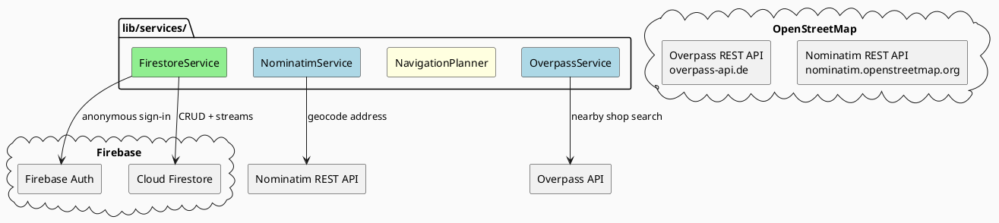
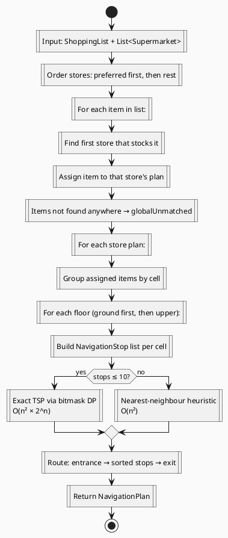

# Services

Services are thin clients for external systems. They are accessed via Riverpod providers and contain no UI logic.

## Service Overview

---

## FirestoreService (`lib/services/firestore_service.dart`)

Central gateway for all cloud sync operations.

### Authentication

Anonymous sign-in is performed once on service construction. The resulting UID is used as `ownerUid` on shops so that other household members cannot overwrite each other's layouts.

### Encryption

All shopping list data is encrypted client-side before being sent to Firestore:

- **Key derivation**: SHA-256 of the household ID → 32-byte AES key.
- **Path derivation**: SHA-256 of the household ID → hex string used as the Firestore path segment. This prevents the plain household code from appearing in the database.
- **Cipher**: AES-256-CBC with a random IV prepended to each ciphertext.
- **Encoding**: `base64` (IV + ciphertext stored as a single `d` field).

Shop layouts (grid structure and goods) are **not encrypted** — they are community-shareable data.

### Firestore Collections

| Path | Encrypted | Description |
|---|---|---|
| `shops/{shopId}` | No | Shop layouts indexed by ownerUid + householdHash |
| `public_shops/{osmId}` | No | Crowd-sourced OSM shop templates |
| `h/{pathId}/l/{listId}` | Yes (`d` field) | Shopping lists per household |
| `h/{pathId}/nav/current` | No | Active collaborative nav session |

### Key Methods

| Method | Description |
|---|---|
| `upsertShop(shop, householdId)` | Write/update a shop document |
| `deleteShop(id)` | Delete a shop document |
| `shopsStream(householdId)` | Real-time stream of household shops |
| `upsertList(list, householdId)` | Encrypt and write a shopping list |
| `deleteList(id, householdId)` | Delete an encrypted list document |
| `listsStream(householdId)` | Real-time stream of decrypted lists |
| `upsertNavSession(session, householdId)` | Create/update collaborative session |
| `deleteNavSession(householdId)` | End a collaborative session |
| `navSessionStream(householdId)` | Real-time stream of active session |
| `searchByName(query)` | Query `nameLower` field (prefix match) |
| `searchByItem(itemName)` | Query `goodsList` array-contains |
| `searchNearby(lat, lng, radius)` | Client-side haversine filter |
| `fetchPublicShop(osmId)` | Load shared OSM layout |
| `upsertPublicCells(osmId, shopFloor)` | Contribute grid layout back to public pool |

---

## NavigationPlanner (`lib/services/navigation_planner.dart`)

Pure Dart service — no I/O. Converts a `ShoppingList` + `List<Supermarket>` into an optimised `NavigationPlan`.

### Algorithm

- **Manhattan distance** is used as the cost metric (grid movement).
- **Multi-floor**: stops on additional floors are grouped and routed independently; the planner produces a `floor` index on each `NavigationStop`.
- The planner is called synchronously (no async) and is suitable for typical store sizes (< 100 cells).

---

## NominatimService (`lib/services/nominatim_service.dart`)

Single-method geocoding client.

- **Endpoint**: `https://nominatim.openstreetmap.org/search`
- **Method**: `geocode(String query) → (double lat, double lng)?`
- Returns the first result or `null` on failure.
- 15-second HTTP timeout.
- `User-Agent: Fairelescourses/1.0` (required by Nominatim policy).

Used by:
- `StoreEditorScreen`: auto-geocodes the address field on save.
- `SyncScreen`: geocodes the user's home address.
- `ShopSearchScreen` (location mode): geocodes the search query before calling Overpass.

---

## OverpassService (`lib/services/overpass_service.dart`)

Searches OpenStreetMap for physical shops near a coordinate.

- **Endpoint**: Overpass API (interpreter endpoint)
- **Method**: `searchNearby(lat, lng, radius, categories) → List<OsmShop>`

### Supported OSM Shop Categories (17)

`supermarket`, `convenience`, `electronics`, `computer`, `doityourself`, `hardware`, `bakery`, `butcher`, `pharmacy`, `clothes`, `department_store`, `furniture`, `books`, `sports`, `garden_centre`, `pet`, `florist`, `shoes`

### OsmShop Fields

| Field | Source |
|---|---|
| `osmId` | OSM node/way ID |
| `name` | `name` tag |
| `brand` | `brand` tag |
| `address` | Composed from `addr:*` tags |
| `lat`, `lng` | Node coords or way centroid |
| `category` | Matched `shop=*` value |

### Query Strategy

- Builds a single Overpass QL query for all requested categories within `radius` metres.
- Handles both `node` and `way` elements (uses `center` lat/lng for ways).
- Results cross-referenced with Firestore in `ShopSearchScreen` to identify already-known shops.
