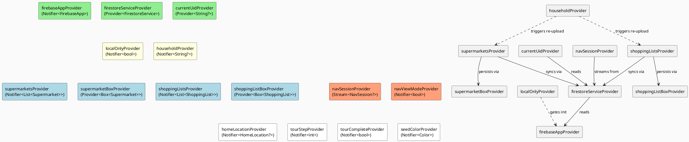
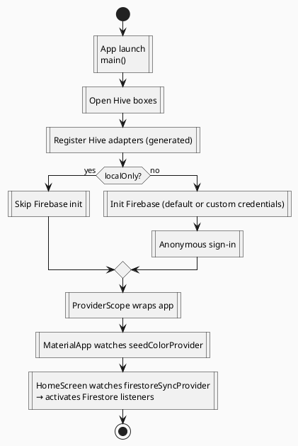

# State Management

The app uses **Riverpod 3** throughout. There are no `StatefulWidget`s that own domain state — all mutable application state lives in Riverpod notifiers.

## Provider Graph



## Provider Reference

| Provider | Type | File | Description |
|---|---|---|---|
| `firebaseAppProvider` | `Notifier<FirebaseApp>` | firebase_app_provider.dart | Holds the active Firebase app (default or custom). Switching instances re-initialises Auth + Firestore. |
| `firestoreServiceProvider` | `Provider<FirestoreService>` | firestore_sync_provider.dart | Lazily creates a `FirestoreService` scoped to the current app. |
| `currentUidProvider` | `Provider<String?>` | firestore_sync_provider.dart | Exposes the anonymous Firebase UID. |
| `firestoreSyncProvider` | `Provider<void>` | firestore_sync_provider.dart | Side-effect provider: subscribes to Firestore streams for shops and lists. Watched by `HomeScreen` to activate. |
| `householdProvider` | `Notifier<String?>` | household_provider.dart | Current 6-char household code. Persisted in Hive `settings`. Join/leave triggers Firestore re-upload. |
| `localOnlyProvider` | `Notifier<bool>` | local_only_provider.dart | When `true`, Firebase is not initialised and sync is disabled. |
| `supermarketsProvider` | `Notifier<List<Supermarket>>` | supermarket_provider.dart | All saved shops. CRUD ops write to Hive and, when online, Firestore. |
| `supermarketBoxProvider` | `Provider<Box<Supermarket>>` | supermarket_provider.dart | Direct access to the Hive box (used by the notifier). |
| `shoppingListsProvider` | `Notifier<List<ShoppingList>>` | shopping_list_provider.dart | All shopping lists. Same dual-write strategy. |
| `shoppingListBoxProvider` | `Provider<Box<ShoppingList>>` | shopping_list_provider.dart | Direct access to the Hive box. |
| `navSessionProvider` | `StreamProvider<NavSession?>` | nav_session_provider.dart | Real-time Firestore stream for the active collaborative session. |
| `navViewModeProvider` | `Notifier<bool>` | nav_view_mode_provider.dart | `true` = list view, `false` = grid view. Persisted in Hive. |
| `seedColorProvider` | `Notifier<Color>` | seed_color_provider.dart | Theme seed colour. Persisted as hex string in Hive. |
| `homeLocationProvider` | `Notifier<HomeLocation?>` | home_location_provider.dart | User's home address + lat/lng for proximity search. Persisted in Hive. |
| `tourStepProvider` | `Notifier<int>` | tour_provider.dart | Current onboarding step (0-3). Advances on milestones. |
| `tourCompleteProvider` | `Notifier<bool>` | tour_provider.dart | `true` once tour is finished or skipped. Persisted in Hive. |

## State Lifecycle



## Notifier Patterns

### Dual-Write (Hive + Firestore)

Both `SupermarketNotifier` and `ShoppingListNotifier` follow this pattern for every mutating operation:

```
1. Update in-memory state immediately (optimistic UI)
2. Write to Hive box (local persistence)
3. If online and household joined → upsert to Firestore
```

Deletions follow the same order and also remove the Firestore document.

### Firestore → Local Sync

`firestoreSyncProvider` subscribes to Firestore streams for both shops and lists. On each event it calls `notifier.mergeFromRemote(items)` which reconciles remote data into the local Hive box, avoiding duplicates and respecting local deletions.

### Tour State Machine

`tourStepProvider` advances through steps 0–3:

| Step | Milestone that advances it |
|---|---|
| 0 | First supermarket saved via StoreEditorScreen |
| 1 | First shopping list saved via ListEditorScreen |
| 2 | Navigation started (play button tapped) |
| 3 (done) | Explicitly completed or skipped |
