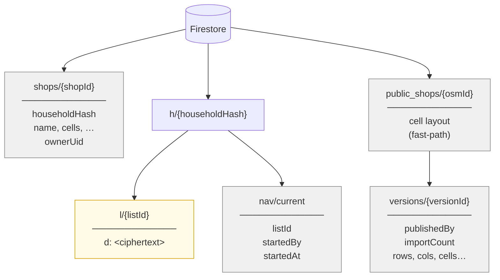
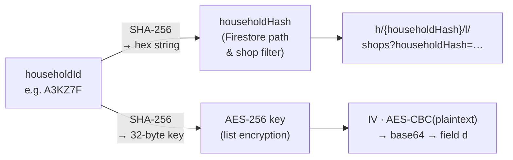
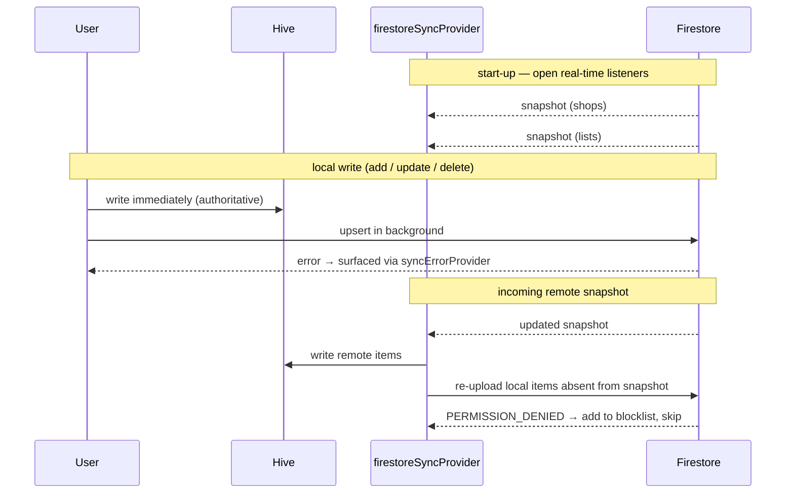
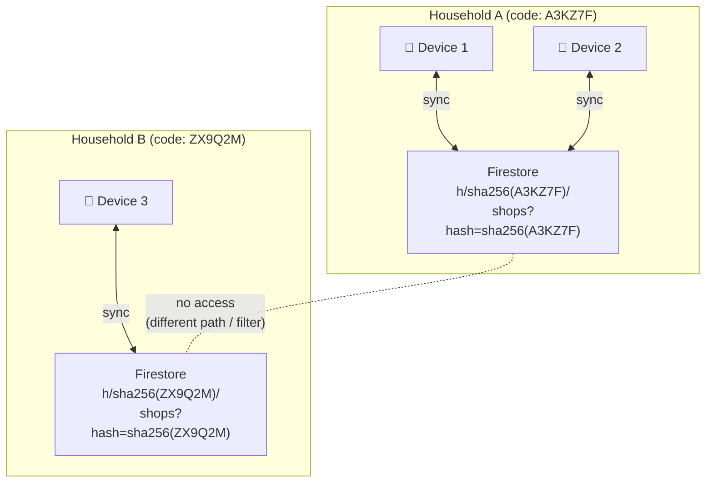
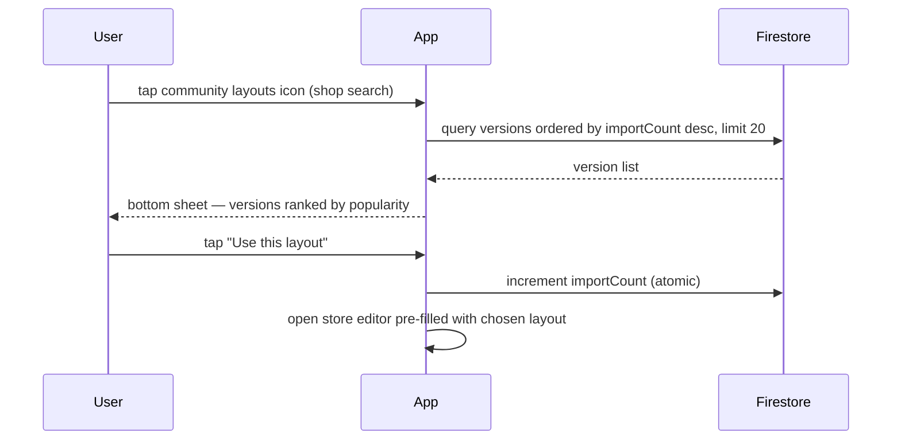

# Data synchronisation

This document describes how shops and lists are stored, synced, and isolated across the three operating contexts the app supports: local-only mode, within a household, and across different households.

---

## Storage layers

The app uses two storage layers in parallel.

**Hive (local, on-device)**

| Box | Content |
|-----|---------|
| `supermarkets` | `Supermarket` objects |
| `shopping_lists` | `ShoppingList` objects |
| `settings` | Key/value strings: household ID, local-only flag, Firebase credentials, UI prefs |
| `item_categories` | Per-item category hints |

**Firestore (remote, per-household)**

| Path | Content | Encrypted |
|------|---------|-----------|
| `shops/{id}` | One document per shop, with a `householdHash` field | No |
| `h/{householdHash}/l/{listId}` | One document per list, with a single `d` field containing the ciphertext | Yes |
| `h/{householdHash}/nav/current` | Active collaborative navigation session | No |
| `public_shops/{osmId}` | Latest cell layout for an OSM shop (fast-path auto-import) | No |
| `public_shops/{osmId}/versions/{versionId}` | Community-contributed layout versions (one per publisher UID), ranked by import count | No |

Hive is always the authoritative live state inside the app. Firestore is a sync medium, not the primary database.

---

## Local-only mode

When local-only mode is enabled (`settings['localOnly'] == 'true'`), Firestore is never contacted. The `firestoreSyncProvider` detects the flag and returns immediately without starting any listeners or upload calls. Firebase is not even initialised.

All shops and lists in this mode exist solely in the Hive boxes. Any `preferredStoreIds` references inside a list point to shops in the same local box; there is no cross-device consistency.

Enabling local-only mode also clears the stored household ID, so leaving local-only mode requires re-entering a household code before sync resumes.

---

## Within a household

A household is identified by a **6-character alphanumeric code** (e.g. `A3KZ7F`). The code is the shared secret for a group of devices.

### Firestore layout

The household code is never written to Firestore in plain text. Before use as a Firestore path segment it is hashed:

```
householdHash = hex(SHA-256(householdId))
```

Shops for the household are stored in the top-level `shops` collection, each tagged with the `householdHash`. Lists are stored under `h/{householdHash}/l/`.



> Yellow = encrypted.

### Encryption

Shopping lists are encrypted before upload. The key is derived from the household code:

```
AES key = SHA-256(householdId)   // 32-byte key
Ciphertext = AES-CBC(key, randomIV) prepended with the 16-byte IV, base64-encoded
```

The same household code also produces the Firestore path hash via a second SHA-256 pass — same input, two independent outputs used for different purposes:



Shops are **not** encrypted. They are filtered by `householdHash` at query time, but their field values (name, cell layout, address) are stored in plain text.

### Relationship between shops and lists

A `ShoppingList` carries a `preferredStoreIds` field — a list of `Supermarket` IDs. This is a soft reference: neither Firestore nor the app validates that the referenced shops exist in the same household. In practice, because both shops and lists sync against the same household, the IDs always match.

The link is one-directional. Shops have no knowledge of which lists reference them.

### Sync flow

`firestoreSyncProvider` runs as a root-level provider. Whenever `householdProvider` emits a non-null ID and local-only mode is off, it opens two real-time Firestore listeners:

- **shopsStream** → feeds `supermarketsProvider`
- **listsStream** → feeds `shoppingListsProvider`



On every incoming snapshot the notifier runs a **merge**:

1. Remote items are written to Hive.
2. Local items not present in the remote snapshot are **re-uploaded**, not deleted. This recovers data that failed to upload during a previous offline period.
3. If an upload returns `PERMISSION_DENIED` the shop ID is added to a per-session blocklist and never retried. (Shops retain an `ownerUid` field, but edit rights are not enforced server-side; the permission error typically means the Firestore security rules rejected the write for another reason.)

On every local write (add, update, delete) the notifier updates Hive immediately and fires a background Firestore upsert. Upload errors are surfaced through `syncErrorProvider` but do not roll back the local change.

### Joining a household

When a device joins a household (by entering the 6-character code on the Sync screen):

1. All shops currently in the local `supermarkets` box are uploaded to `shops/` tagged with the new `householdHash`.
2. All lists in the local `shopping_lists` box are encrypted and uploaded to `h/{householdHash}/l/`.
3. The household ID is persisted to Hive, which activates the real-time listeners.

Local data is **migrated** into the household, not discarded. A device that had data in local-only mode and then joins a household contributes that data to the household.

### Leaving a household

Leaving clears the household ID from Hive and stops the Firestore listeners. Local Hive data is untouched. Remote Firestore data is not deleted — it stays under the old `householdHash` path indefinitely. If the device later rejoins the same household it will re-download that data.

---

## Across different households

Household data is isolated at the Firestore query level:

- **Shops** are queried with a `where('householdHash', isEqualTo: ...)` filter, so only shops tagged for the current household are ever downloaded.
- **Lists** are under `h/{householdHash}/l/`, a path that is structurally separate for every household.



There is no server-side membership check. The household code is the only credential. Two devices that share the same 6-character code share all data, regardless of who created the code. Two devices with different codes never see each other's shops or lists.

When a device switches to a different household:

- It stops listening to the old household's Firestore paths.
- Local Hive data from the old household remains on device.
- On joining the new household the existing local data is uploaded and tagged with the new `householdHash` (see [Joining a household](#joining-a-household) above).
- Data from the old household is not downloaded and `preferredStoreIds` references in migrated lists may point to shops that no longer exist locally. The app tolerates dangling references — unmatched items are listed at the end of the navigation route.

Switching the Firebase backend (entering custom Firebase credentials on the Sync screen) also clears the household ID and makes the previous Firestore project unreachable, regardless of whether the household code itself changed.

---

## Community layouts

Community layouts are cell-layout snapshots contributed by any user and browsable by any other user for the same OSM shop. They are stored in `public_shops/{osmId}/versions/` and are **not** tied to any household.

### Data model

Each version document contains:

| Field | Content |
|-------|---------|
| `osmId` | OpenStreetMap node ID |
| `publishedBy` | Firebase UID of the publisher |
| `publishedAt` | Server timestamp |
| `importCount` | How many times this version has been imported (incremented atomically) |
| `shopName`, `address` | Display metadata |
| `rows`, `cols`, `entrance`, `exit`, `cells` | Full cell layout |
| `subcells` | Optional subcell assignments |
| `floors` | Optional additional floors |

The parent document `public_shops/{osmId}` (no subcollection) holds the **most recently saved** layout for that OSM shop. It is written automatically every time any user saves an OSM-linked shop (via `upsertPublicCells` in the `SupermarketNotifier`), regardless of whether they have explicitly published a community version. It exists as a fast-path for auto-import: when a different user first adds the same OSM shop, `fetchPublicShop` reads this document and pre-populates the editor without needing to query and rank the full versions subcollection.

### Publish flow

The flat `public_shops/{osmId}` document is updated automatically on every save of an OSM-linked shop. At the same time, the app upserts the publisher's version slot (`versions/{uid}`), so there is no separate publish step.

When a user saves an OSM-linked layout (`autoPublishVersion`):

1. The publisher's document at `public_shops/{osmId}/versions/{uid}` is created or updated (import count is preserved).
2. The flat `public_shops/{osmId}` document is overwritten with the latest layout for fast-path imports.

Different users keep separate version documents; re-saving by the same user updates their existing one.

### Browse and import flow



The import count increment is fire-and-forget (`.ignore()`); a failure does not block the editor from opening.

If no versions exist for the shop the bottom sheet shows an empty state with a **Create** button that opens the store editor directly, letting the user be the first to contribute.

### Isolation and access control

Community layouts are **global** — they are not filtered by household. Any authenticated user can read or write any `public_shops` document. There is no ownership check on individual versions.

This is intentional: the purpose of the collection is cross-household sharing. The trade-off is that any authenticated user can publish a layout for any OSM shop. Abuse is limited by the anonymous-auth requirement (a Firebase account is always present) and by the fact that layouts contain only cell/aisle geometry — no personal data.

---

## Security properties

| Property | Mechanism |
|----------|-----------|
| Lists are confidential | AES-CBC encryption; key never leaves the device |
| Household ID not stored in plain text in Firestore | SHA-256 hash used as path and filter field |
| Shops visible only to household members | `householdHash` filter (trusts the client) |
| No server-side access control | The app relies on secrecy of the 6-character code; anyone with the code has full read/write access |
| Community layouts are not confidential | `public_shops` is readable and writable by any authenticated user; layouts contain only aisle geometry, no personal data |

The threat model assumes that the 6-character household code is kept within the household. There is no revocation mechanism: removing a device from a household requires changing the code on all remaining devices.
