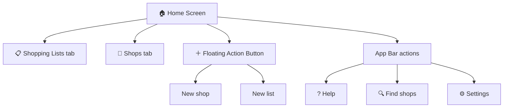
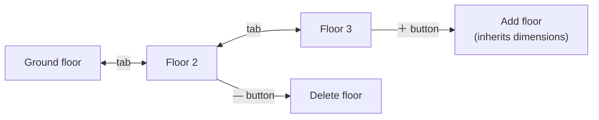
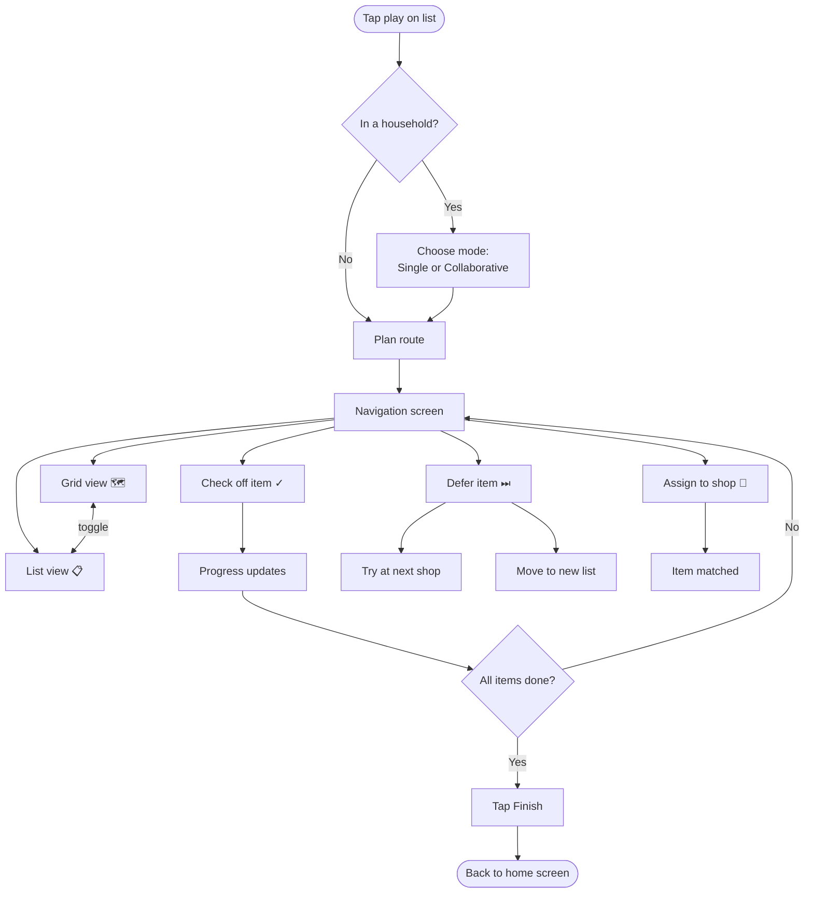
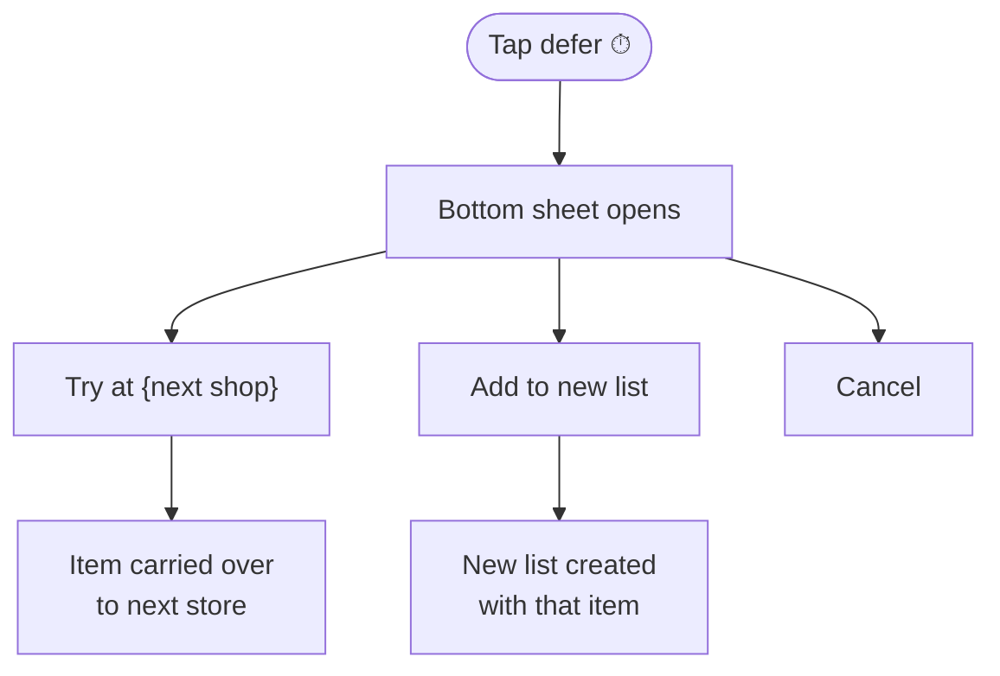
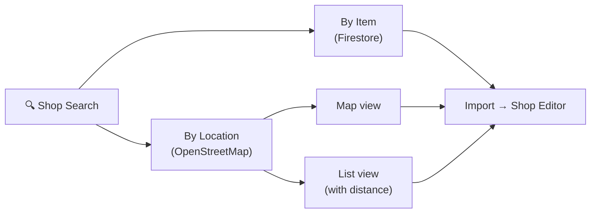
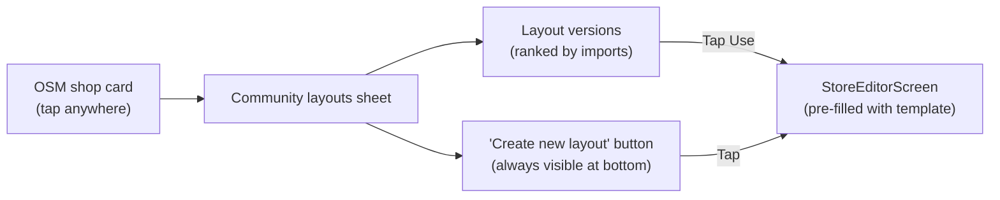
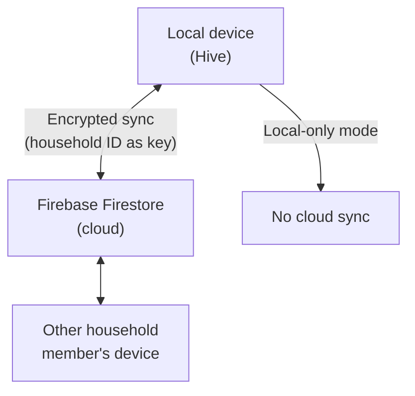
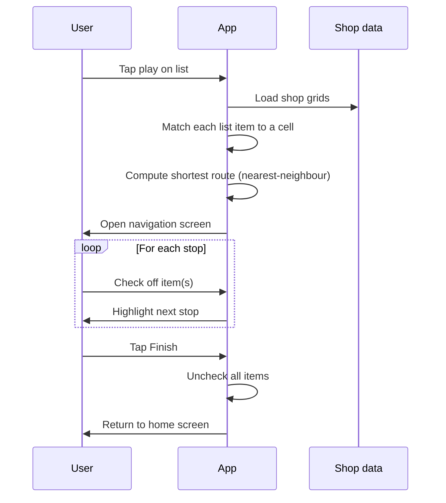
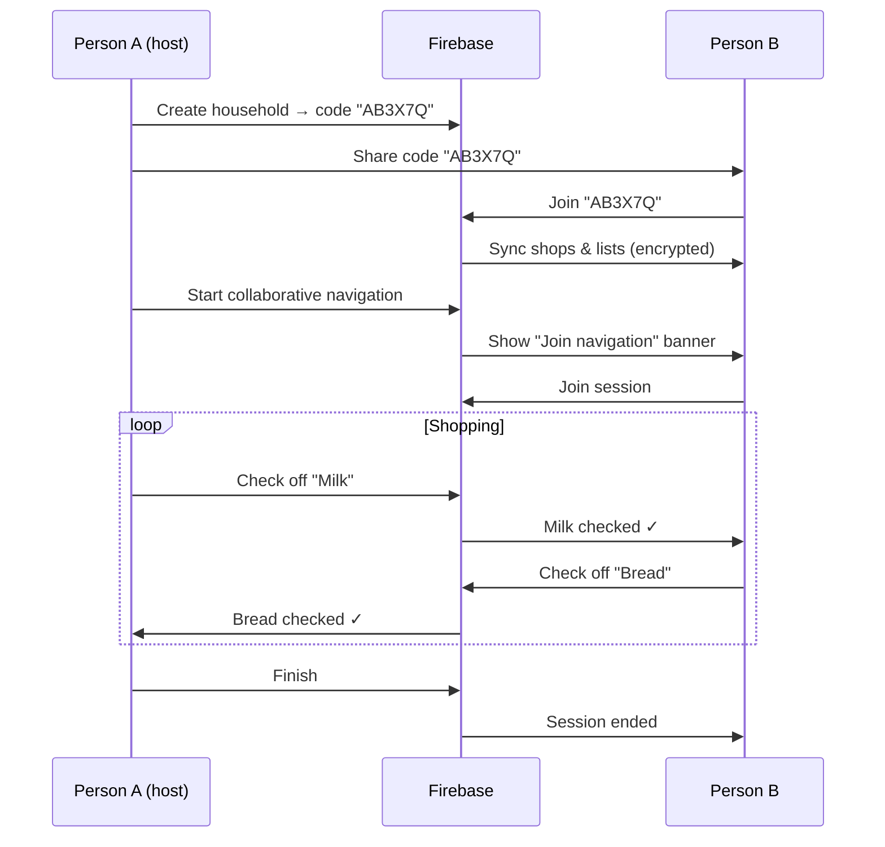
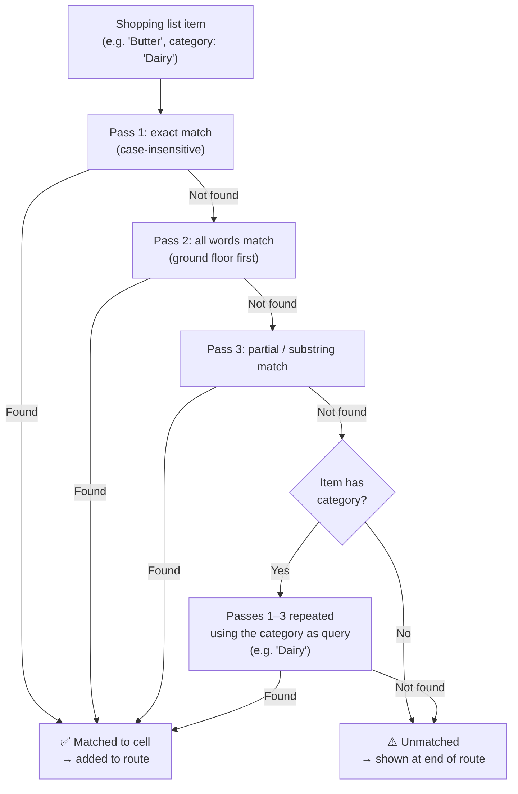

# Fairelescourses [/fɛʁ le kuʁs/] — User guide

**Version 0.9.27**

Fairelescourses is a supermarket navigation assistant. You draw your shops as grids, assign goods to cells, and the app plans the shortest route through the store for your shopping list — so you never have to backtrack.

---

## Table of contents

1. [Quick start](#1-quick-start)
2. [Home screen](#2-home-screen)
3. [Creating and editing shops](#3-creating-and-editing-shops)
4. [Shopping lists](#4-shopping-lists)
5. [Navigation](#5-navigation)
6. [Finding shops](#6-finding-shops)
7. [Households and sync](#7-households-and-sync)
8. [Settings](#8-settings)

---

## 1. Quick start

When you open the app for the first time, the help screen explains the basics. The **?** button in the top-right corner opens it again whenever you need a reminder.

To get started:

1. Create a **shop** — draw its grid and optionally assign goods to cells (or start from a community layout).
2. Create a **shopping list** — add the items you want to buy.
3. Tap the **play** button next to your list to start your first shopping trip.

---

## 2. Home screen

The home screen has two tabs: **Shopping Lists** and **Shops**.



### Shopping lists tab

Each list card shows:
- The list name
- A progress count — e.g. **3/8 items** — with a progress bar once you've started shopping

Tap a list to edit it. Tap the **play** button to start navigating.

When two or more lists are similar, you can **merge** them:
1. Long-press any list to enter multi-select mode.
2. Tap additional lists to select them.
3. Tap **Merge** in the bar at the bottom, then choose which list absorbs the others.

Duplicate items are removed automatically.

### Shops tab

Each shop card shows its name and grid size (e.g. **5×4**). Multi-floor shops also show a floor count.

Tap the card to open the shop editor. Tap the trash icon to delete the shop (with confirmation).

### Floating action button

Tap **+** to expand two quick-create buttons:
- **New shop** — opens the shop editor
- **New list** — opens the list editor

---

## 3. Creating and editing shops

A "shop" in Fairelescourses is a grid where each cell represents a shelf, aisle section, or area of the store, and goods are assigned to those cells.

### 3.1 Basic setup

1. Open **New shop** from the FAB (or the Shops tab).
2. Enter a **name** (required) and an optional **address**.
3. Set the number of **rows** (labelled A, B, C…) and **columns** (labelled 1, 2, 3…).
4. Set the **entrance** cell (e.g. `A1`) and **exit** cell (e.g. `E5`).
5. Tap **Save**.

The entrance and exit tell the navigation planner where your route starts and ends.

### 3.2 Assigning goods to cells

Tap any cell in the grid to open its editor. Enter the goods stored there as a comma-separated list:

```
Milk, Yogurt, Cream, Butter
```

Tap **Save** in the dialog. Cells that have goods show a short preview inside the square.

**Tip:** Start with a coarse grid (e.g. 4×4 for the main areas), then refine it later by splitting cells.

### 3.3 Splitting cells

If one aisle has two distinct sides, double-tap the cell to split it:
- Choose **Add row** (top/bottom halves) or **Add column** (left/right halves).
- The cell becomes two sub-cells (e.g. `A2:top` and `A2:bottom`).

To undo a split, long-press the sub-cell and choose **Revert split**.

To promote a split across an entire row or column (turning a local split into a real grid row or column), long-press and choose **Promote split**.

### 3.4 Multi-floor shops

For multi-level stores, use the floor tabs at the top of the editor.



Each floor has its own grid, entrance, and exit. New floors inherit the dimensions of the previous floor to save setup time.

### 3.5 Grid at a glance

| Gesture | Action |
|---|---|
| Tap cell | Edit goods |
| Double-tap cell | Split into two halves |
| Long-press sub-cell | Revert or promote split |
| Tap **+** at edge | Add a row or column |
| Tap **×** on header | Remove that row or column |
| Long-press header | Delete row/column (with confirmation) |

---

## 4. Shopping lists

### 4.1 Creating a list

1. Tap **New list** from the FAB.
2. Give the list a name (e.g. "Weekly shop").
3. Optionally, select one or more **preferred shops**. The navigation planner will try to match items to those shops first.
4. Add items one by one in the field at the bottom. The app suggests goods from your shops as you type.
   - Each item can have an optional **category** (e.g. "Dairy"). Tap the item after adding it to set or change the category.
   - The app remembers the last category you assigned to each item name and pre-fills it automatically next time.
5. Tap **Save**. Any text typed in the add-item field but not yet confirmed is automatically added to the list before saving.

### 4.2 Editing items

Each item has a three-dot menu with:
- **Rename** — edit the name and optional category, with autocomplete
- **Delete** — remove from list
- **Move to list** — transfer the item to a different list

Drag the handle on the left to reorder items.

### 4.3 Navigating away

If you tap **Back** with unsaved changes, a dialog asks whether to **Save**, **Discard**, or **Keep editing**.

---

## 5. Navigation

Tap the **play** button on any list to start a shopping trip.



### 5.1 Grid view

The **mini-map** at the top shows a small overview of the entire floor:

| Cell colour | Meaning |
|---|---|
| Blue with arrow | Current stop (navigate here next) |
| Blue with dot | Future stop |
| Green with ✓ | Completed stop |
| Faint secondary colour | Adjacent to last checked-off item |
| Green background | Entrance |
| Red background | Exit |

The arrow on the current cell rotates to point toward the next stop.

Below the mini-map, the main grid shows the same layout at full size. Tap a cell (or the items listed in it) to check off goods.

### 5.2 List view

Switch to list view for a linear view of all items across all stores, ordered by the navigation route. Shop names appear as section headers. Unmatched items appear at the end.

### 5.3 Checking off items

Tap the checkbox next to any item (in either view) to mark it as collected. The progress counter updates immediately. In collaborative mode, all household members see the change in real time.

Tap again to uncheck.

### 5.4 Deferring an item

If a product is out of stock or you want to pick it up at a later stop, tap the **clock icon** next to the item:



A deferred item is shown with a strikethrough. Tap the **undo** icon to restore it.

### 5.5 Unmatched items

Items the planner couldn't match to any shop cell appear in a separate section. You can:
- **Check them off** anyway (e.g. if you found it by browsing).
- **Assign to a shop** — a dialog asks you to choose or search for the right store; once you've saved the assignment, the item is resolved and the route updates.

### 5.6 Multi-floor navigation

When a store has multiple floors, the navigator guides you floor by floor. A floor selector is shown at the top of the grid view. The mini-map always reflects the current floor.

### 5.7 Finishing a trip

When all items are resolved, a **Finish** button appears. Tapping it:
1. Unchecks all items in the list (resetting it for reuse).
2. Returns you to the home screen.

---

## 6. Finding shops

The **search** icon in the app bar opens the shop search screen. You can discover shops from two sources:



### 6.1 Search by item

Search for a specific product (e.g. "tofu") to find Firestore shops that stock it. Results show shops from your household's shared Firestore pool that have that product tagged in a cell.

### 6.2 Search by location (OpenStreetMap)

1. Set your home location in **Settings** first (enter your city or address and tap **Set**).
2. Switch to **By location** mode.
3. The app queries OpenStreetMap for nearby supermarkets, pharmacies, bakeries, etc.
4. Filter by category (Supermarket, Convenience, Pharmacy…) and adjust the search radius.
5. Toggle between the **list view** and **map view**.

Tap any OSM result to open the community layouts sheet, where you can pick an existing layout or create a new one from scratch (see §6.3).

If the shop is already in your list, it shows **Already defined** and tapping opens the shop editor directly.

### 6.3 Community layouts

Tapping any OSM result opens the community layouts sheet — a list of cell-layout blueprints that other users have contributed for that exact shop.



Layouts are ranked by how many times they have been imported — the most-used layout appears first. Each entry shows the grid size, number of floors, and how long ago it was published.

Tapping **Use this layout** opens the shop editor pre-filled with that layout. You can adjust it before saving.

A **Create new layout** button is always visible at the bottom of the sheet, so you can start from scratch even when community layouts exist.

#### Publishing your own layout

Saving an OSM-linked shop automatically shares its cell layout in the background (it becomes the fast-path template other users see when first importing the same shop). To create a proper community version — one that appears in the ranked list — you need to publish explicitly:

1. Open the saved OSM shop in the editor.
2. Tap the **share icon** in the app bar (visible only for OSM shops outside local-only mode).
3. Confirm the dialog.

A new version is always appended; existing versions contributed by others are never overwritten.

Shop location data is from **OpenStreetMap contributors (ODbL)**.

---

## 7. Households and sync

Households let multiple people share shops and shopping lists, and check off items together in real time.

### 7.1 How sync works



All data synced to Firestore is encrypted using your household ID as the key. The server cannot read your shops or lists.

### 7.2 Creating a household

1. Open **Settings** (⚙ in the app bar).
2. Tap **Create new household**.
3. A six-character code is generated (e.g. `AB3X7Q`).
4. Share it with household members using the **Share ID** button.

### 7.3 Joining a household

1. Open **Settings**.
2. Enter the six-character code in the **Join household** field.
3. Tap **Join household**.

Your local shops and lists are uploaded and merged with the household's data.

> **Note:** You can only be in one household at a time. Join a new one only after leaving the current one.

### 7.4 Leaving a household

Tap **Leave household** in Settings and confirm. Your local data remains on your device; sync is disabled.

### 7.5 Collaborative navigation

When you're in a household, the play button offers two modes:

| Mode | What happens |
|---|---|
| **Single** | Only your device tracks progress |
| **Collaborative** | All household members see checked items in real time |

In collaborative mode, a banner appears on the home screen of other members:

> "Collaborative navigation active — [list name]"

Tap **Join** to participate. All check-offs by any member are visible to everyone instantly.

The session ends when the host taps **Finish**. Members who haven't joined simply see the banner disappear.

### 7.6 Local-only mode

If you don't want any cloud sync, enable **Local storage only** in Settings. The toggle is confirmed with a dialog. In this mode:
- Household and sync features are disabled.
- All data stays on your device.
- You can still use all navigation and shop-editing features.

---

## 8. Settings

Open Settings with the **⚙** button in the app bar.

### Home location

Enter your city or address and tap **Set**. The app geocodes it via Nominatim (OpenStreetMap) and saves the coordinates. This is required for **Search by location**.

### Default navigation view

Choose whether navigation opens in **Grid** view or **List** view by default. You can always switch between them during a trip.

### Menu color

Choose one of eight preset accent colors for the app's theme.

### Firebase configuration (advanced)

By default, Fairelescourses uses a shared built-in Firebase instance. If you want to run your own backend:

1. Tap **Change** next to the Firebase instance.
2. Read and confirm the warning (this is advanced territory).
3. Enter your Firebase project credentials — or paste the contents of your `google-services.json`.
4. Tap **Apply**.

The Firebase help screen (accessible from this section) explains how to set up the required Firebase project, Firestore database, anonymous authentication, and security rules.

To revert to the default instance, tap **Reset to default**.

### Reset all local data

Tap **Reset all local data** to delete all local shops, lists, and settings. A confirmation dialog appears first. This cannot be undone.

---

## Appendix: Key flows at a glance

### Planning a shopping trip



### Joining and using a household




### Item matching during route planning


